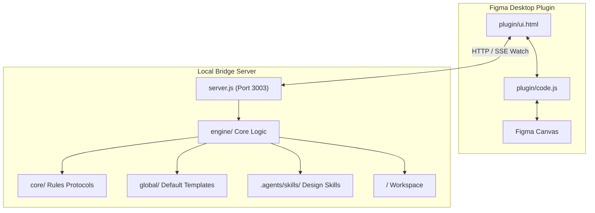

# Morph — AI-Powered Figma Screen Generator

> Turn natural language prompts into production-quality, Auto Layout Figma screens in seconds. Morph is a self-contained AI system that transforms text prompts into editable UI layouts, master component sets, and native Figma variables with minimal token consumption.

<p align="left">
  
  
  
  
</p>

---

## Prerequisites

Before getting started, make sure you have the following ready:

| Prerequisite | Recommended Tools | Description |
|---|---|---|
| 🤖 **AI Assistant / Copilot** | Antigravity, Cursor, Claude Code, VS Code Copilot, Codex, Gemini | Any LLM-powered coding assistant or copilot to orchestrate prompts and generate scripts. |
| 💻 **Code Editor / IDE** | Antigravity, VS Code, Cursor | Any modern code editor to open the project, view files, and run the integrated terminal. |
| ⚡ **Node.js** | Node.js (v18+ recommended) | Needed to run the local lightweight bridge server (`server.js`) that connects your AI to Figma. |
| 🎨 **Figma Desktop App** | Figma Desktop (Mac / Windows) | Required to run local development plugins (*Figma Developer Mode is recommended*). |

> [!NOTE]
> **How It Works (Under the Hood):**  
> Your AI Copilot generates clean Figma API scripts directly inside your project folder. The local bridge server (`server.js`) automatically detects new scripts and streams them to the Figma Desktop plugin live via SSE (Server-Sent Events) in 3–5 seconds—no manual copy-pasting needed!

---

## How to Use

Follow these 10 simple steps to set up Morph and start generating Figma screens with AI:

```mermaid
flowchart LR
    A["1. Download & Unzip"] --> B["2. Open in IDE"]
    B --> C["3. npm install"]
    C --> D["4. Configure ui.html"]
    D --> E["5. Import Plugin in Figma"]
    E --> F["6. Start node server.js"]
    F --> G["7. Connect Plugin"]
    G --> H["8. @newproject & @brief"]
    H --> I["9. Customize (Optional)"]
    I --> J["10. Prompt Screens 🚀"]
```



---

### Step 1: Download & Unzip the Repository
1. Download this repository as a ZIP archive (click the green **Code** button on GitHub → **Download ZIP**).
2. Unzip the downloaded file on your computer.
3. Open the extracted `Figma-Mcp` folder.

---

### Step 2: Open in Your IDE & Launch Terminal
1. Open the unzipped `Figma-Mcp` folder in your preferred code editor (such as **Antigravity**, **VS Code**, or **Cursor**).
2. Open the integrated terminal inside the IDE:
   - **Shortcut:** `Ctrl + \`` (Windows/Linux) or `Cmd + \`` (Mac)
   - **Menu:** `Terminal` → `New Terminal`

---

### Step 3: Install Node.js Dependencies
In the integrated terminal, navigate to the `FigmaPlugin` folder and install the required dependencies:

```bash
cd FigmaPlugin && npm install
```

> Once the packages are installed, your environment is ready to run the local bridge server.

---

### Step 4: Configure Local Endpoint in Plugin UI
Open [`FigmaPlugin/plugin/ui.html`](file:///Users/fwcuser/Desktop/Figma-Mcp/FigmaPlugin/plugin/ui.html):
1. Press `Ctrl + F` (or `Cmd + F` on Mac) and search for `https://figma-mcp-topaz.vercel.app`.
2. Delete or comment out the hosted cloud URL line.
3. Ensure the local endpoint (`http://localhost:3003`) on the next line is active/uncommented:

```javascript
// Comment or delete this line:
// const SERVER = 'https://figma-mcp-topaz.vercel.app';

// Enable / uncomment this line:
const SERVER = 'http://localhost:3003';
```
4. Save the file (`Ctrl + S` / `Cmd + S`).

---

### Step 5: Import Plugin into Figma Desktop
1. Open the **Figma Desktop App**.
2. From the top navigation menu or canvas context menu, go to:
   - **Plugins** → **Development** → **Import plugin from manifest...**
3. Navigate to your project folder and select:
   - `Figma-Mcp/FigmaPlugin/plugin/manifest.json`
4. The Morph plugin is now installed under your development plugins!

> [!TIP]
> **Figma Developer Mode (Recommended):** Enabling Developer Mode (`Shift + D`) in Figma helps easily inspect generated layer structures, spacing, tokens, and component properties.

---

### Step 6: Start the Local Bridge Server
In your IDE terminal, ensure you are in the `FigmaPlugin` folder and start the bridge server:

```bash
cd FigmaPlugin
node server.js
```

You will see output confirming the bridge server is active and listening on `http://localhost:3003`:
```
[Server] Figma Bridge Server running on http://localhost:3003
[Watcher] Watching dynamic projects in FigmaPlugin/
```

---

### Step 7: Launch Plugin & Verify Connection
1. In Figma, open any design file or create a new draft.
2. Launch the plugin: **Plugins** → **Development** → **Morph / Figma Screen Generator**.
3. The plugin header will display a green status indicator: **`Connected (Port 3003)`**.

---

### Step 8: Initialize a New Project with AI
Open your AI Copilot / AI Assistant chat inside the IDE and type the initialization command:

```text
@newproject <ProjectName>
@brief <Product Description & Domain>
```

**Example Prompt:**
```text
@newproject TravelLux
@brief A luxury boutique hotel booking application for discerning travelers featuring curated destination cards, immersive photo galleries, filterable amenities, and 1-click room reservations.
```

Press **Enter**. The AI automatically scaffolds the project directory under `FigmaPlugin/<ProjectName>/` with customized design context templates (`brief.md`, `colors.md`, `fonts.md`, `taste.md`).

---

### Step 9 (Optional): Customize Colors, Fonts & Visual Taste
Before or during generation, you can fine-tune your project's visual direction using AI commands:

- **Change Brand Colors:**  
  `@color #4F46E5, #06B6D4`
- **Change Typography:**  
  `@font DM Sans` *(or `@font Instrument Sans`)*
- **Change Visual Style / Taste:**  
  `@taste sleek dark mode, 16px micro-paddings, subtle 1px border hair-lines, glassmorphism cards`
- **Publish Native Figma Variables & Styles:**  
  `@gen-variables`
- **Build Master Component Sets & Variants:**  
  `@gen-components` or `@designsystem`

---

### Step 10: Generate Screens
Prompt your AI assistant in natural language to generate any UI screen:

**Example Prompt:**
```text
Create a modern mobile hotel detail screen with a full-width hero photography carousel, title and star rating row, expandable amenities grid, room selection cards with pricing, and a sticky bottom booking bar.
```

The AI generates the script, writes it to `screens/<screen_name>.js`, and the bridge instantly renders the screen on your Figma canvas in real time!

> [!IMPORTANT]
> **Auto Layout Fallback Tip (`@skip-autolayout`):**  
> If an AI-generated screen does not render properly or if you want static absolute positioning without Auto Layout constraints, simply prepend `@skip-autolayout` before your prompt:  
> `@skip-autolayout Create a dashboard screen with sidebar navigation and analytics charts.`

---

## Supported Commands

Commands can be passed directly inside prompts or executed via AI coding agents:

| Command | Category Tag | Purpose |
|---|---|---|
| `@newproject <Name>` |  | Initializes project directory structure (`screens/`, `components/`, `tokens/`, `local/`). |
| `@brief <Description>` |  | Defines product domain, target audience, and core features in `local/brief.md`. |
| `@gen-variables` |  | Publishes native Figma color variables and text styles to the Figma file. |
| `@gen-components` |  | Generates master reusable components inside `components/`. |
| `@use-components` |  | Forces screen scripts to instantiate master components (`createInstance()`). |
| `@designsystem` |  | Runs full pipeline: token extraction, component set generation, and screen updates. |
| `@font <FontName>` |  | Overrides font family for the generation session. |
| `@color <Hex1>, <Hex2>` |  | Overrides brand primary and secondary color tokens. |
| `@taste <Description>` |  | Overrides visual styling attributes (radii, borders, shadows). |
| `@skip-autolayout` |  | Disables Auto Layout and uses absolute X/Y positioning. |
| `@skip-design-taste` |  | Bypasses extended design guidelines for minimal token generation. |

---

## MVP Notice & Troubleshooting

Morph is currently an **MVP**. Auto Layout generation is heavily optimized, but occasional layout edge cases may occur depending on prompt complexity.

<p align="left">
  
</p>

| Issue | Quick Fix Tag | Action |
|---|---|---|
| **Auto Layout Collapse** |  | Use `@skip-autolayout` to generate static absolute positioning, or manually adjust **Hug Contents** / **Fill Container** in Figma's right-hand Auto Layout panel. |
| **Cropped Canvas** |  | If a generated frame is named **"Generated UI Screen"** and appears cropped, select the frame and **ungroup it once** (`Cmd + Shift + G` / `Ctrl + Shift + G`) to reveal the complete screen structure. |

---

## Technical Details & Architecture

### The Problem: Screenshot-Based AI Generation

Most Figma MCP tools rely on image analysis loops (*prompt → screenshot → analyze image → code → repeat*). Vision models consume thousands of tokens per iteration, add 30-60 seconds of latency per loop, and struggle to infer exact padding and alignment constraints from pixels.

<p align="left">
  
  
  
</p>

---

### The Solution: Code-Driven Direct Execution

Morph eliminates image analysis by generating structured Figma API scripts directly. LLMs understand code far better than raw pixels. Colors, font sizes, paddings, and layout relationships are explicit in code, allowing the model to produce exact, Auto Layout-correct screens in 3-5 seconds with minimal token consumption.

<p align="left">
  
  
  
</p>

---

### Technical Comparison

| Metric | Screenshot-Based Tools | Morph (Code-Driven) | Advantage Tag |
|---|---|---|---|
| **Input Format** | Heavy Pixel Images | Structured Code Scripts |  |
| **Fidelity** | Estimated Pixel Bounds | Exact Auto Layout Constraints |  |
| **Cost Efficiency** | High Cost Per Iteration | Minimal Token Usage |  |
| **Speed** | 30-60 Seconds Per Loop | 3-5 Seconds Direct Script Execution |  |

---

### Model Optimization Notice

Morph is currently optimized for **Google Gemini Flash** models due to their high speed, large context windows, and strong compliance with structured script synthesis. Support for custom API keys (OpenAI, Anthropic, and local LLMs) will be introduced in future releases.

<p align="left">
  
  
</p>

---

### System Architecture



---

### Core Execution Protocols (`core/`)

When a generation request is initialized, the system prompt builder reads the core protocol directives:

| File | Protocol Tag | Purpose |
|---|---|---|
| [`core/command.md`](file:///Users/fwcuser/Desktop/Figma-Mcp/FigmaPlugin/core/command.md) |  | Command syntax resolution and priority execution logic. |
| [`core/instruction.md`](file:///Users/fwcuser/Desktop/Figma-Mcp/FigmaPlugin/core/instruction.md) |  | Core screen generation rules, vector icon loading protocols, and typography scaling constraints. |
| [`core/autolayout.md`](file:///Users/fwcuser/Desktop/Figma-Mcp/FigmaPlugin/core/autolayout.md) |  | Mandatory Auto Layout construction order and anti-pattern prevention. |
| [`core/component.md`](file:///Users/fwcuser/Desktop/Figma-Mcp/FigmaPlugin/core/component.md) |  | Master component set creation and instance reuse guidelines. |
| [`core/variables.md`](file:///Users/fwcuser/Desktop/Figma-Mcp/FigmaPlugin/core/variables.md) |  | Native Figma Variables and Local Text Styles publishing protocol. |

---

### Supporting Directories

- **Default Context Templates (`global/`):** Contains baseline reference files (`brief.md`, `colors.md`, `fonts.md`, `taste.md`) copied into each project's `local/` directory upon initialization.
- **AI Skill Registry (`.agents/skills/`):** Domain design skills (`frontend-design`, `design-taste-frontend`, `ui-design-system`, `figma-screen-generator`) automatically injected into prompt context during screen and component generation.
- **Backend Implementation (`engine/`):** Underlying Node.js execution logic for API requests, Gemini model integration, storage management, and rate limiting.

---

### Summary

Morph is a lightweight, high-speed UI generation architecture that bridges natural language prompts directly to native Figma Auto Layout canvas elements. By shifting from image-based vision analysis to direct script synthesis, Morph delivers faster generation times, lower token costs, and extensible workflows for both designers and developers.