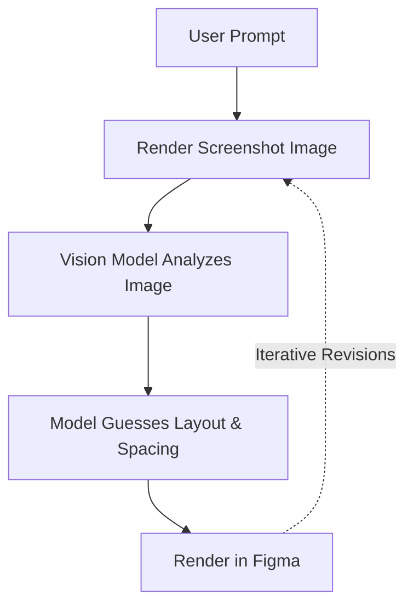
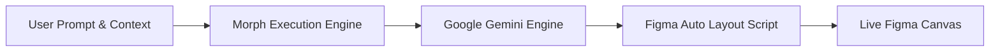
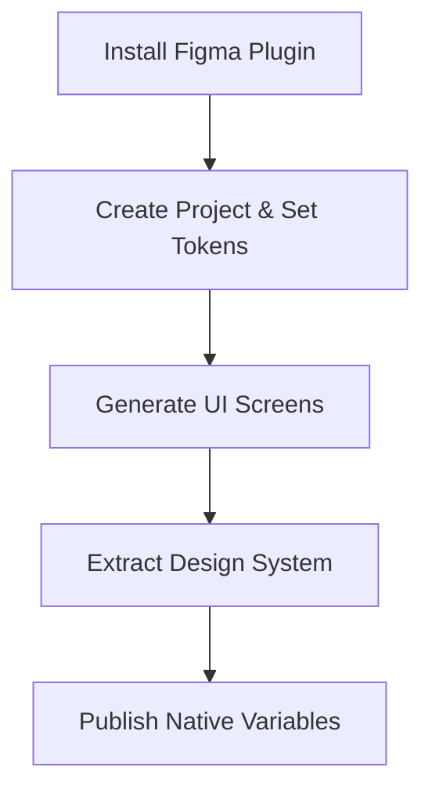
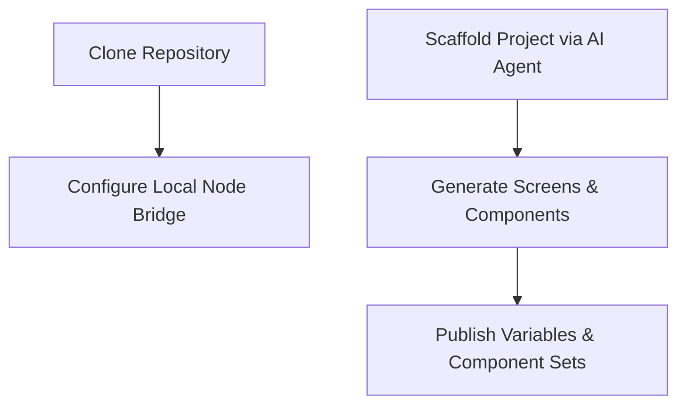
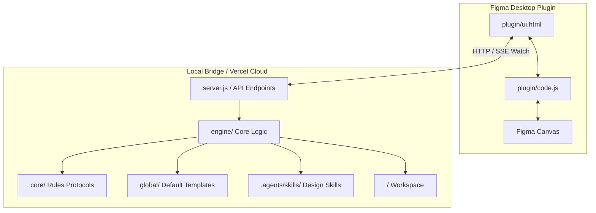

# Morph — AI-Powered Figma Screen Generator

> Turn natural language prompts into production-quality, Auto Layout Figma screens in seconds. Morph analyzes code instead of screenshots, generating precise UI layouts, master component sets, and native Figma variables with minimal token consumption.

<p align="left">
  
  
  
  
</p>

---

> [!NOTE]
> **What is Morph?** Morph is a self-contained AI system that transforms text prompts into editable, Auto Layout-compliant Figma UI screens. Instead of relying on raster screenshots, Morph generates structured JavaScript execution scripts directly inside Figma's API sandbox.

---

## 🎯 Target Audiences

| Audience | Tag | Primary Workflow | Key Advantages |
|---|---|---|---|
| **Developers** |  | Clone repository, integrate with preferred IDE or AI assistant (Claude, Cursor, Copilot) | Zero API fees by leveraging existing AI subscriptions, full script control |
| **Designers** |  | Install Figma plugin, configure project tokens, generate screens and design systems | No coding required, automatic design system generation from screen patterns |

---

## ⚠️ The Problem: Screenshot-Based AI Generation

Most existing Figma AI workflows rely on iterative screenshot analysis, creating significant performance and cost bottlenecks.

> [!WARNING]
> **Screenshot Loop Flaws:**
> 1. **High Token Consumption:** Multi-modal vision models consume thousands of tokens per image iteration.
> 2. **Slow Feedback Loops:** Generating and re-analyzing raster images adds 30-60 seconds of latency per loop.
> 3. **Imprecise Layouts:** Vision models struggle to infer exact padding, gap values, and Auto Layout constraints from raw pixels.



---

## 💡 The Solution: Code-Driven Direct Execution

Morph replaces image-based analysis with direct code synthesis. The AI generates clean Figma API scripts that execute natively on the canvas.

> [!TIP]
> **Why Code Generation Wins:**
> Large Language Models understand code far better than raw pixels. Colors, font sizes, paddings, and layout relationships are explicit in code, allowing the model to produce exact, Auto Layout-correct screens on the first pass.



### 📊 Technical Comparison

| Metric | Screenshot-Based Tools | Morph (Code-Driven) | Advantage Tag |
|---|---|---|---|
| **Input Format** | Heavy Pixel Images | Structured Code Scripts |  |
| **Fidelity** | Estimated Pixel Bounds | Exact Auto Layout Constraints |  |
| **Cost Efficiency** | High Cost Per Iteration | Minimal Token Usage |  |
| **Speed** | 30-60 Seconds Per Loop | 3-5 Seconds Direct Script Execution |  |

---

### 🤖 Model Optimization & Roadmap

Morph is currently optimized for **Google Gemini Flash** models due to their speed, large context windows, and strong compliance with structured script generation.

<p align="left">
  
  
</p>

---

## 🔄 User Workflows

### 🎨 Designer Workflow (Plugin-Only)

> [!NOTE]
> Designers do not need to write any code. Simply install the plugin, configure your brand identity, and let Morph handle layout synthesis and component extraction.



1. **Install Plugin:** Import `FigmaPlugin/plugin/manifest.json` into Figma Desktop (`Plugins → Development → Import plugin from manifest`).
2. **Setup Project:** Click `New Project` and define project name, domain brief, color palette, typography, and visual taste.
3. **Generate Screens:** Describe desired UI screens using natural language prompts.
4. **Build Design System:** Click `Build Design System` after generating a few screens. Morph automatically extracts colors, typography, and component patterns into master variants.
5. **Publish Tokens:** Export native Figma Variables and Text Styles to your Figma file.

---

### 💻 Developer Workflow (IDE & Agent-Driven)

> [!TIP]
> Developers can run Morph locally using their preferred AI coding assistant (Claude, Cursor, Copilot) with existing subscriptions, avoiding third-party API charges.



1. **Clone & Install:**
   ```bash
   git clone https://github.com/Anshul2021/Figma-Mcp.git
   cd Figma-Mcp/FigmaPlugin
   npm install
   ```
2. **Start Local Bridge:**
   ```bash
   node server.js
   ```
3. **Orchestrate via Agent:** Use any coding agent to execute commands against project directories.
4. **Iterate & Refine:** Scripts automatically sync to the Figma canvas in real-time via the local SSE server.

---

## ☁️ Vercel Deployment (Supabase Storage)

Morph's serverless backend persists projects, screens, and users in **Supabase Storage** (a private bucket). Vercel Blob is no longer used.

1. **Create a Supabase project** at [supabase.com](https://supabase.com) (free tier is fine).
2. **Create the storage bucket:** In the Supabase dashboard go to **Storage → New bucket**, name it `morph`, and set it to **private**.
3. **Grab your keys:** Go to **Project Settings → API** and copy `Project URL` and the `service_role` key (server-side only — never ship it to the browser).
4. **Add Vercel environment variables** for the project:
   - `SUPABASE_URL` = your project URL
   - `SUPABASE_SERVICE_ROLE_KEY` = your service role key
   - (optional) `SUPABASE_BUCKET` = bucket name, defaults to `morph`
   - Keep `GEMINI_API_KEY`, `GEMINI_MODEL`, and `ADMIN_TOKEN` set as before.
5. **Redeploy.** Storage is written server-side with the service role key; the bucket stays private and the browser never talks to it.

To test cloud mode locally, set the two Supabase vars (and `CLOUD_STORE=1`) in `FigmaPlugin/.env`:

```bash
CLOUD_STORE=1 PORT=3003 node server.js
```

---

## ⚡ Supported Commands

Commands can be passed directly inside prompts or executed via AI coding agents.

| Command | Tag | Category | Description |
|---|---|---|---|
| `@newproject <Name>` |  | Scaffolding | Initializes project directory structure (`screens/`, `components/`, `tokens/`, `local/`). |
| `@brief <Description>` |  | Context | Defines product domain, target audience, and core features in `local/brief.md`. |
| `@gen-variables` |  | Design Tokens | Publishes native Figma color variables and text styles to the Figma file. |
| `@gen-components` |  | Components | Generates master reusable components inside `components/`. |
| `@use-components` |  | Optimization | Forces screen scripts to instantiate master components (`createInstance()`). |
| `@designsystem` |  | Pipeline | Runs full pipeline: token extraction, component set generation, and screen updates. |
| `@font <FontName>` |  | Override | Overrides font family for the generation session. |
| `@color <Hex1>, <Hex2>` |  | Override | Overrides brand primary and secondary color tokens. |
| `@taste <Description>` |  | Styling | Overrides visual styling attributes (radii, borders, shadows). |
| `@skip-autolayout` |  | Fallback | Disables Auto Layout and uses absolute X/Y positioning. |
| `@skip-design-taste` |  | Performance | Bypasses extended design guidelines for minimal token generation. |

---

## 🛠️ MVP Status & Troubleshooting Notice

> [!WARNING]
> **MVP Notice:** Morph is currently an **MVP**. Auto Layout rules are heavily optimized, but occasional layout edge cases may occur depending on prompt complexity.

### Quick Fixes & Handlers

- **Layout Adjustments:** If an Auto Layout container collapses, use `@skip-autolayout` to generate static absolute positioning, or manually adjust **Hug Contents** / **Fill Container** in Figma's right-hand Auto Layout panel.
- **Cropped Canvas Fix:** If a generated frame is named **"Generated UI Screen"** and appears cropped on the canvas, select the frame and **ungroup it once** (`Cmd + Shift + G` / `Ctrl + Shift + G`) to reveal the complete screen structure.

---

## 🏗️ Technical Architecture



### 📄 Core Execution Protocol Files (`core/`)

When a generation request is initialized, the system prompt builder reads the core protocol directives:

| File | Protocol Tag | Purpose |
|---|---|---|
| [`core/command.md`](file:///Users/fwcuser/Desktop/Figma-Mcp/FigmaPlugin/core/command.md) |  | Command syntax resolution and priority execution logic. |
| [`core/instruction.md`](file:///Users/fwcuser/Desktop/Figma-Mcp/FigmaPlugin/core/instruction.md) |  | Core screen generation rules, vector icon loading protocols, and typography scaling constraints. |
| [`core/autolayout.md`](file:///Users/fwcuser/Desktop/Figma-Mcp/FigmaPlugin/core/autolayout.md) |  | Mandatory Auto Layout construction order and anti-pattern prevention. |
| [`core/component.md`](file:///Users/fwcuser/Desktop/Figma-Mcp/FigmaPlugin/core/component.md) |  | Master component set creation and instance reuse guidelines. |
| [`core/variables.md`](file:///Users/fwcuser/Desktop/Figma-Mcp/FigmaPlugin/core/variables.md) |  | Native Figma Variables and Local Text Styles publishing protocol. |

---

### 📂 Supporting System Directories

#### 1. Default Context Templates (`global/`)
Contains baseline reference files (`brief.md`, `colors.md`, `fonts.md`, `taste.md`) that are copied into each project's `local/` directory upon initialization.

#### 2. AI Skill Registry (`.agents/skills/`)
Contains domain-specific design skills (`frontend-design`, `design-taste-frontend`, `ui-design-system`, `figma-screen-generator`) automatically injected into prompt context during screen and component generation.

#### 3. Backend Implementation (`engine/`)
Contains underlying Node.js execution logic for API requests, Gemini model integration, storage management, and rate limiting.

---

> [!IMPORTANT]
> **Summary:** Morph is a high-speed UI generation architecture that bridges natural language prompts directly to native Figma Auto Layout canvas elements. By shifting from image-based vision analysis to direct script synthesis, Morph delivers faster generation times, lower token costs, and extensible workflows for both designers and developers.