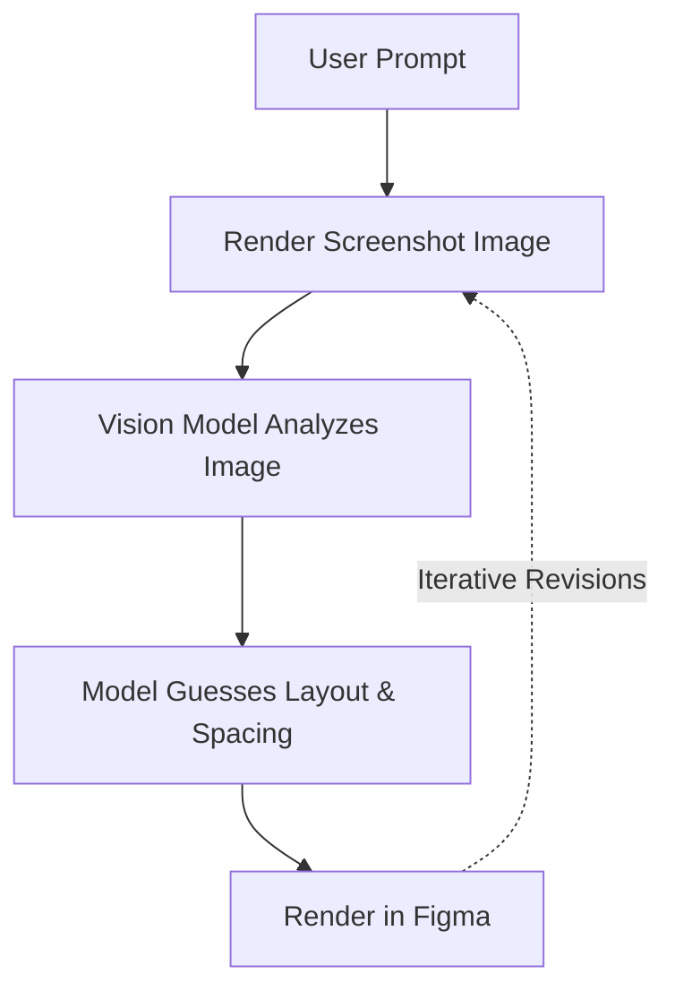
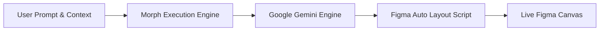
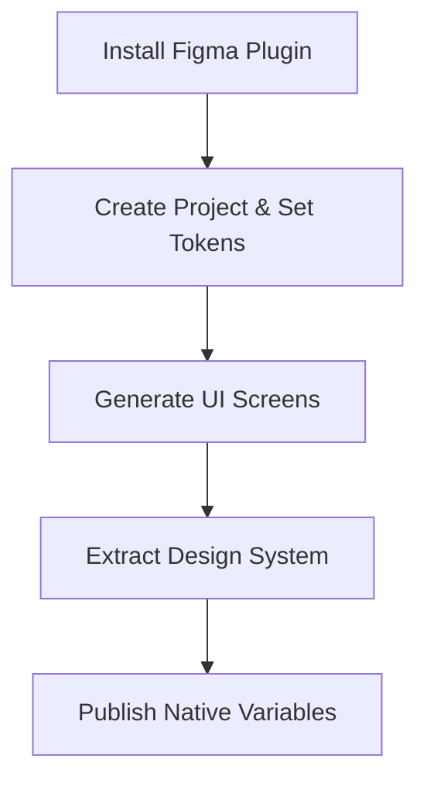
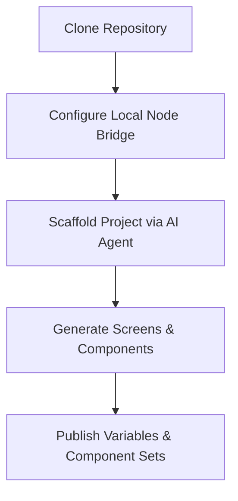
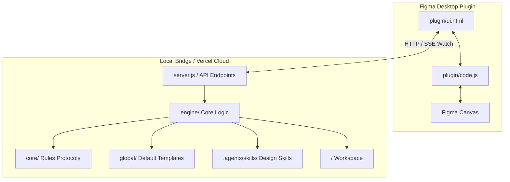

# Morph — AI-Powered Figma Screen Generator

> Turn natural language prompts into production-quality, Auto Layout Figma screens in seconds. Morph analyzes code instead of screenshots, generating precise UI layouts, master component sets, and native Figma variables with minimal token consumption.

<p align="left">
  
  
  
  
</p>

---

## Overview

Morph is a self-contained AI system that transforms text prompts into editable, Auto Layout-compliant Figma UI screens. Instead of relying on raster screenshots, Morph generates structured JavaScript execution scripts directly inside Figma's API sandbox.

### Target Audiences

| Audience Tag | Primary Workflow | Key Advantages |
|---|---|---|
|  | Clone repository, integrate with preferred IDE or AI assistant (Claude, Cursor, Copilot) | Zero API fees by leveraging existing AI subscriptions, full script control |
|  | Install Figma plugin, configure project tokens, generate screens and design systems | No coding required, automatic design system generation from screen patterns |

---

## The Problem: Screenshot-Based AI Generation

Most existing Figma AI workflows rely on iterative screenshot analysis, creating significant performance and cost bottlenecks.



### Limitations of Image-Based Workflows

- **High Token Consumption:** Multi-modal vision models consume thousands of tokens per image iteration.
- **Slow Feedback Loops:** Generating and re-analyzing raster images adds significant latency.
- **Imprecise Layouts:** Models struggle to infer exact padding, gap values, and Auto Layout constraints from pixels.

---

## The Solution: Code-Driven Direct Execution

Morph replaces image-based analysis with direct code synthesis. The AI generates clean Figma API scripts that execute natively on the canvas.



### Key Technical Advantages

| Metric | Screenshot-Based Tools | Morph (Code-Driven) |
|---|---|---|
| **Input Format** | Heavy Pixel Images |  |
| **Fidelity** | Estimated Bounds |  |
| **Cost Efficiency** | High Cost Per Iteration |  |
| **Speed** | 30-60 Seconds Per Loop |  |

### Model Optimization Notice

Morph is currently optimized for **Google Gemini Flash** models due to their speed, large context windows, and strong compliance with structured script generation. Support for custom API keys (OpenAI, Anthropic, and local LLMs) will be introduced in future releases.

---

## Workflows

### Designer Workflow (Plugin-Only)



1. **Install Plugin:** Import `FigmaPlugin/plugin/manifest.json` into Figma Desktop.
2. **Setup Project:** Define project name, domain brief, color palette, typography, and visual taste.
3. **Generate Screens:** Describe desired UI screens using natural language prompts.
4. **Build Design System:** Click **Build Design System** to automatically extract master components, swatches, and typography scales from generated screens.
5. **Publish Tokens:** Export native Figma Variables and Text Styles to the Figma file.

---

### Developer Workflow (IDE & Agent-Driven)



1. **Clone & Install:**
   ```bash
   git clone https://github.com/Anshul2021/Figma-Mcp.git
   cd Figma-Mcp/FigmaPlugin
   npm install
   ```
2. **Start Local Bridge:**
   ```bash
   node server.js
   ```
3. **Orchestrate via Agent:** Use any coding assistant (Claude, Cursor, Copilot) to execute commands against project directories.
4. **Iterate & Refine:** Scripts automatically sync to the Figma canvas via the local SSE watch server.

---

## Supported Commands

Commands can be passed directly inside prompts or executed via AI coding agents.

| Command | Tag | Category | Description |
|---|---|---|---|
| `<kbd>@newproject &lt;Name&gt;</kbd>` |  | Scaffolding | Initializes a project directory structure (`screens/`, `components/`, `tokens/`, `local/`). |
| `<kbd>@brief &lt;Text&gt;</kbd>` |  | Context | Defines product domain, audience, and core features in `local/brief.md`. |
| `<kbd>@gen-variables</kbd>` |  | Design Tokens | Publishes native Figma color variables and text styles to the Figma file. |
| `<kbd>@gen-components</kbd>` |  | Components | Generates master reusable components in `components/`. |
| `<kbd>@use-components</kbd>` |  | Optimization | Forces screen scripts to instantiate master components (`createInstance()`). |
| `<kbd>@designsystem</kbd>` |  | Pipeline | Runs full pipeline: token extraction, component set generation, and screen updates. |
| `<kbd>@font &lt;FontName&gt;</kbd>` |  | Override | Overrides font family for the generation session. |
| `<kbd>@color &lt;Hex1&gt;, &lt;Hex2&gt;</kbd>` |  | Override | Overrides brand primary and secondary color tokens. |
| `<kbd>@taste &lt;Description&gt;</kbd>` |  | Styling | Overrides visual styling attributes (radii, borders, shadows). |
| `<kbd>@skip-autolayout</kbd>` |  | Fallback | Disables Auto Layout and uses absolute X/Y positioning. |
| `<kbd>@skip-design-taste</kbd>` |  | Performance | Bypasses extended design guidelines for minimal token generation. |

---

## MVP Status & Troubleshooting Notice

> **Important:** Morph is currently an **MVP**. Auto Layout generation rules are heavily optimized, but occasional layout edge cases may occur depending on prompt complexity.

### Recommended Handlers

- **Layout Fixes:** If an Auto Layout container collapses, use `<kbd>@skip-autolayout</kbd>` to generate static absolute positioning, or manually adjust **Hug Contents** / **Fill Container** in Figma's Auto Layout panel.
- **Cropped Canvas Fix:** If a generated frame is named **"Generated UI Screen"** and appears cropped, select the parent frame and **ungroup it once** (`Cmd + Shift + G` / `Ctrl + Shift + G`) to reveal the complete container.

---

## Technical Architecture



### Core Execution Protocol Files (`core/`)

When a generation request is initialized, the system prompt builder reads the core protocol directives:

| File | Tag | Purpose |
|---|---|---|
| [`core/command.md`](file:///Users/fwcuser/Desktop/Figma-Mcp/FigmaPlugin/core/command.md) |  | Command syntax resolution and priority execution logic. |
| [`core/instruction.md`](file:///Users/fwcuser/Desktop/Figma-Mcp/FigmaPlugin/core/instruction.md) |  | Core screen generation rules, vector icon loading protocols, and typography scaling constraints. |
| [`core/autolayout.md`](file:///Users/fwcuser/Desktop/Figma-Mcp/FigmaPlugin/core/autolayout.md) |  | Mandatory Auto Layout construction order and anti-pattern prevention. |
| [`core/component.md`](file:///Users/fwcuser/Desktop/Figma-Mcp/FigmaPlugin/core/component.md) |  | Master component set creation and instance reuse guidelines. |
| [`core/variables.md`](file:///Users/fwcuser/Desktop/Figma-Mcp/FigmaPlugin/core/variables.md) |  | Native Figma Variables and Local Text Styles publishing protocol. |

---

### Supporting System Directories

#### Default Context Templates (`global/`)
Contains baseline reference files (`brief.md`, `colors.md`, `fonts.md`, `taste.md`) that are copied into each project's `local/` directory upon initialization.

#### AI Skill Registry (`.agents/skills/`)
Contains domain-specific design skills (`frontend-design`, `design-taste-frontend`, `ui-design-system`, `figma-screen-generator`) automatically injected into prompt context during screen and component generation.

#### Backend Implementation (`engine/`)
Contains underlying Node.js execution logic for API requests, Gemini model integration, storage management, and rate limiting.

---

## Summary

Morph is a lightweight, high-speed UI generation architecture that bridges natural language prompts directly to native Figma Auto Layout canvas elements. By shifting from image-based vision analysis to direct script synthesis, Morph delivers faster generation times, lower token costs, and extensible workflows for both designers and developers.