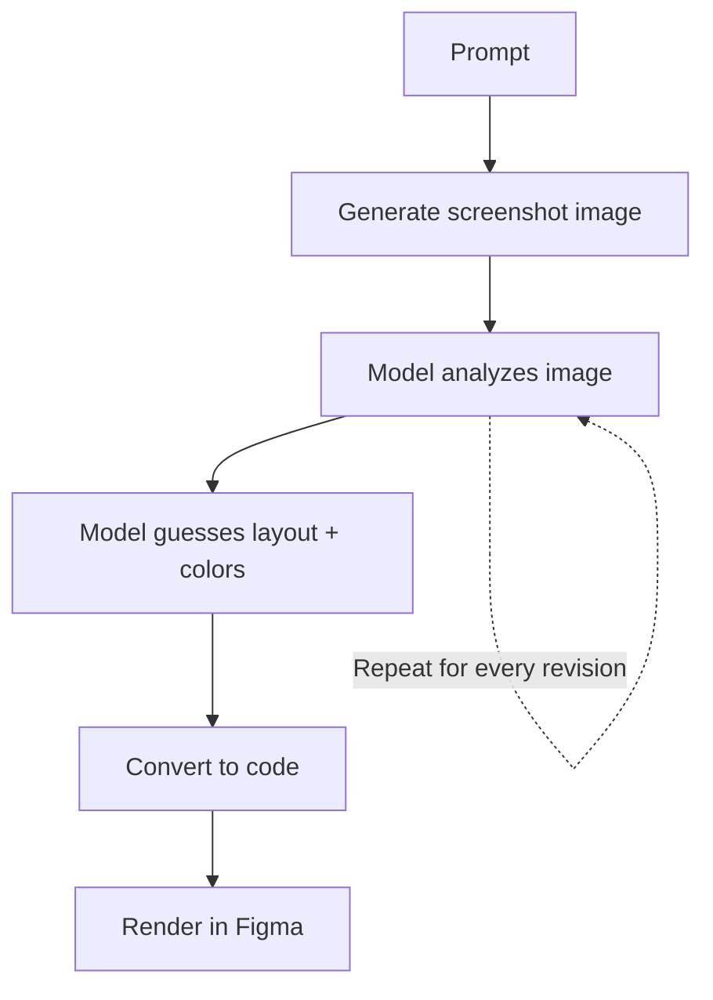
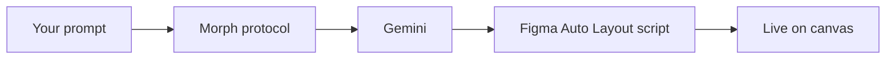
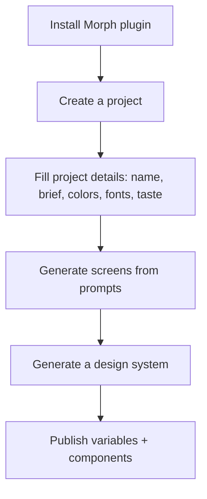
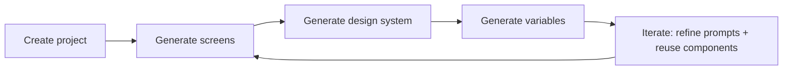
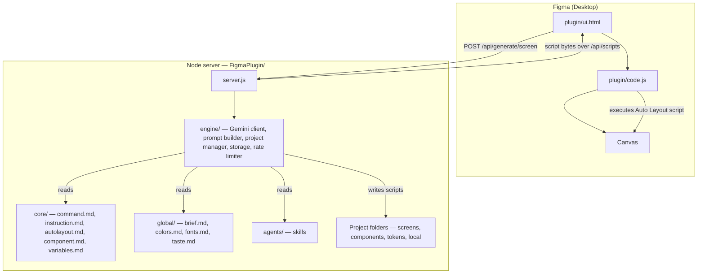
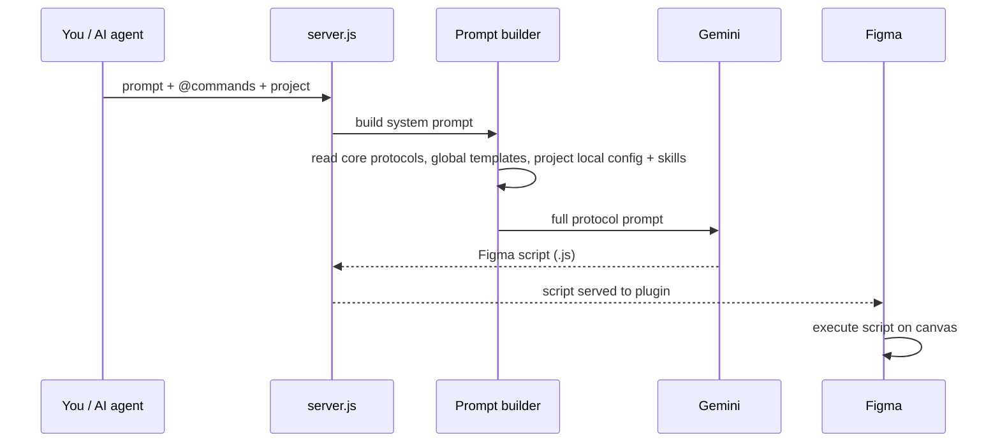

# Morph — AI-Powered Figma Screen Generator

> Turn a sentence into a production-quality Figma screen. Morph reads your brief, applies real design-system rules, writes a Figma Auto Layout script, and renders it on your canvas in seconds — no screenshots, no manual spacing.

| Label | Value |
|---|---|
| Status | MVP — actively developed |
| Model | Google Gemini Flash (current) |
| Output | Native Figma Auto Layout screens, components, tokens |
| Workflow | Natural language prompt → Figma script → live canvas |
| Cost | Dramatically fewer tokens than screenshot-based generators |

---

## Overview

Morph is a **self-contained AI workspace for generating Figma UI screens**. You describe a screen — *"Instagram-style profile page with a photo grid"* — and Morph produces a finished, Auto Layout-based screen directly inside Figma. It also generates **master component sets** and **native Figma Variables** so a full design system can be assembled automatically from your screens.

### Two ways to use it

| | Developers | Designers |
|---|---|---|
| What you do | Clone, code, and orchestrate with your own AI assistant | Install the Figma plugin and just describe screens |
| AI cost | None extra — uses your existing Claude / Cursor / Copilot subscription | Built-in Gemini key (cheap, fast) |
| Output | Full control over scripts, prompts, and architecture | Screens, design systems, and tokens with one click |
| Best for | Building on this project, automation, custom workflows | Rapid UI exploration without writing code |

---

## The Problem: screenshot-based generation is slow and expensive

Most "Figma MCP" tools work like this today — and every step burns tokens:



- Every revision regenerates a **raster image** the model must re-analyze.
- Models consume a huge number of tokens reading images, and still **misjudge spacing, fonts, and alignment**.
- Loops of *screenshot → analyze → code* make the process **slow, expensive, and imprecise**.

---

## The Solution: Morph generates code, not screenshots



Morph **never renders a screenshot**. Instead:

1. Your prompt is combined with design protocols (Auto Layout rules, component rules, variable rules).
2. **Gemini** writes a clean Figma script — colors, typography, layout, icons, spacing all decided in one pass.
3. The plugin **executes the script** in Figma's sandbox, and the screen appears on your canvas live.

### Why this is faster, cheaper, and more accurate

| Factor | Screenshot-based approach | Morph (code-based) |
|---|---|---|
| Model input | Raster image | Structured text (code + rules) |
| Tokens per iteration | Very high | Low |
| Revision feedback loop | Generate image → re-analyze | Rewrite code directly |
| Layout fidelity | Guessed from pixels | Explicit Auto Layout properties |
| Cost | Expensive | Cost-effective |

> **Why code wins:** models understand code far better than pixels. Colors, font sizes, paddings, and layout relationships are all explicit in script, so the model produces precise, consistent, Auto Layout-correct screens instead of reconstructing details from an image.

### Model support

Morph currently ships with **Gemini Flash models**, chosen because they are highly optimized for this kind of structured script generation.

| Model | ID | Daily credits |
|---|---|---|
| Gemini 3.6 Flash (recommended) | `gemini-3.6-flash` | 10 / day |
| Gemini 3.5 Flash | `gemini-3.5-flash` | 10 / day |
| Gemini 3.5 Flash Lite | `gemini-3.5-flash-lite` | 10 / day |
| Gemini 3.1 Flash Lite | `gemini-3.1-flash-lite` | 10 / day |
| Gemini 3 Flash | `gemini-3-flash` | 10 / day |
| Gemini 2.5 Flash | `gemini-2.5-flash` | 10 / day |
| Gemini 2.5 Flash Lite | `gemini-2.5-flash-lite` | 10 / day |

In the future you will be able to bring your own API key for **OpenAI or other providers**. For now, Morph focuses on Gemini only.

---

## For Designers: generate screens without writing code

You never touch a script. The plugin does everything.



### Step-by-step

1. **Install the plugin** — open Figma Desktop, then `Plugins → Development → Import plugin from manifest` and select `FigmaPlugin/plugin/manifest.json`.
2. **Launch Morph** and enter your name.
3. **Create a project** — click `New Project` and fill in the project details:

   | Field | Example |
   |---|---|
   | Name | `FoodDelivery` |
   | Brief | A food delivery app for urban millennials |
   | Colors | `#FF6B35`, `#2EC4B6`, `#1A1A2E`, `#E8E8E8` |
   | Font | `Poppins` |
   | Taste | Warm, rounded 12px corners, soft shadows, vibrant photography |

4. **Generate screens** — click `Generate Screen`, type a description, pick a model, and the screen renders on your canvas instantly.
5. **Generate a design system** — after a few screens exist, run `Build Design System`. Morph **extracts the colors, typography, and component patterns** from your generated screens and assembles reusable master components, swatches, and a type scale.
6. **Publish variables** — generate native Figma Variables and text styles that the generated artboards reference.

---

## For Developers: run it yourself and build on top

Morph is a thin, hackable Node server plus a Figma plugin. You are not limited to Gemini — use **Claude, Cursor, Copilot, or any coding agent** you already pay for, in any IDE, to drive the same protocols. Because it uses your existing subscription instead of per-call APIs, iterating is effectively free.

### Quick setup

<details>
<summary><b>Setup steps (click to expand)</b></summary>

```bash
# 1. Clone the repository
git clone https://github.com/Anshul2021/Figma-Mcp.git
cd Figma-Mcp/FigmaPlugin

# 2. Install dependencies
npm install

# 3. Configure environment
cp .env.example .env
#    set GEMINI_API_KEY (get yours at https://aistudio.google.com/apikey)

# 4. Start the local server
node server.js
```

Then import the plugin in Figma (`Plugins → Development → Import plugin from manifest` → `FigmaPlugin/plugin/manifest.json`).

</details>

### The developer loop



1. **Create a project** — type `<kbd>@newproject MyApp</kbd>` in your assistant, or use the plugin's `New Project` form. Add a brief with `<kbd>@brief ...</kbd>`.
2. **Generate screens** — prompt in plain language (or via the plugin). Each screen is a `.js` Auto Layout script saved to `FigmaPlugin/<Project>/screens/`.
3. **Generate a design system** — run `<kbd>@designsystem</kbd>` (or the plugin button) to build master component sets.
4. **Generate variables** — run `<kbd>@gen-variables</kbd>` to publish native Figma Variables and text styles.
5. **Iterate** — screens reuse the master components via `<kbd>@use-components</kbd>`, so your design stays consistent as you add screens.

---

## Supported commands

Type these inside the plugin prompt or include them in your assistant prompts.

| Command | What it does |
|---|---|
| <kbd>@newproject &#60;Name&#62;</kbd> | Scaffold a fresh project workspace (`screens/`, `components/`, `tokens/`, `local/`) |
| <kbd>@brief &#60;description&#62;</kbd> | Set the product brief / domain context for all future generations |
| <kbd>@gen-variables</kbd> | Publish native Figma Variables and text styles to the Variables panel |
| <kbd>@gen-components</kbd> | Create reusable master components |
| <kbd>@use-components</kbd> | Use existing master components (`createInstance`) instead of raw inline frames |
| <kbd>@designsystem</kbd> | End-to-end pipeline: tokens + analysis + component sets + screen update |
| <kbd>@font &#60;Font&#62;</kbd> | Override the font family for the session |
| <kbd>@color &#60;Hex&#62;, &#60;Hex&#62;</kbd> | Override primary and secondary brand colors |
| <kbd>@taste &#60;style&#62;</kbd> | Override visual styling (glassmorphism, dark mode, shadows, etc.) |
| <kbd>@skip-autolayout</kbd> | Fall back to absolute x/y positioning instead of Auto Layout |
| <kbd>@skip-design-taste</kbd> | Bypass visual taste guardrails for ultra-fast, minimal-token generation |

---

## Important: this is an MVP

Morph is an early, actively developed product. The Auto Layout generation has been heavily optimized, but there may be occasional cases where a screen doesn't come out perfectly.

If that happens:

1. Use **<kbd>@skip-autolayout</kbd>** to generate a static layout with absolute coordinates instead.
2. Or fix it manually in Figma — typically a minor **Hug Contents** / **Fill Container** tweak in the Auto Layout panel.
3. If a generated frame is named **"Generated UI Screen"** and looks cropped, **select it and ungroup once** — the complete screen is there, just wrapped.

---

## Technical architecture



| Layer | Purpose |
|---|---|
| `plugin/` | The Figma client — UI (`ui.html`), main thread (`code.js`), `manifest.json` |
| `server.js` | API backend: project CRUD, AI generation, script serving, SSE bridge |
| `core/` | Immutable engine protocols the AI must follow when writing scripts |
| `global/` | Default templates copied into every new project |
| `.agents/skills/` | AI skills auto-applied during generation |
| `engine/` | Implementation code (one line: the generation engine) |

### How the generation engine is structured

```text
Figma-Mcp/
├── AGENTS.md                     Orchestrator directives for every AI session
├── .agents/skills/               AI skill registry used while generating
└── FigmaPlugin/
    ├── server.js                 Node API server + SSE bridge
    ├── core/                     Immutable generation protocols
    ├── global/                   Default context templates
    ├── engine/                   Implementation code
    ├── plugin/                   Figma plugin client
    └── <ProjectName>/            Your projects (screens, components, tokens, local)
```

---

## Execution flow

When you start a new project or prompt, the system:



1. The agent reads **AGENTS.md** — the master directives for generating and orchestrating.
2. Based on your prompt, it pulls the relevant **core protocol files** below.
3. It merges them with your project's **`local/` config** (brief, colors, fonts, taste) and the **skills** folder.
4. The assembled prompt goes to **Gemini**, which returns a Figma script.
5. The server saves the script, and the plugin executes it live.

### Core protocol files

| File | Purpose |
|---|---|
| `core/command.md` | Syntax and priority of every `@command` supported by the system |
| `core/instruction.md` | Core generation rules, zero-emoji + vector-icon guidelines, even-number font sizes |
| `core/autolayout.md` | The exact Auto Layout execution order and anti-patterns to avoid (prevents 100px-square frames) |
| `core/component.md` | How master components are created and reused via `createInstance()` |
| `core/variables.md` | How native Figma Variables and text styles are published |

### Default templates (`global/`)

Every project starts from these reference files (copied into its `local/` folder so you can override per project):

| File | Purpose |
|---|---|
| `global/fonts.md` | Default font family + strict even-number type scale |
| `global/colors.md` | Default color tokens (brand, neutral scale, semantic status) |
| `global/taste.md` | Default visual styling, radii, and borders |
| `global/brief.md` | Default app brief template |

### AI skills (`.agents/skills/`)

These are auto-applied whenever you generate screens or a design system:

| Skill | Purpose |
|---|---|
| `frontend-design` | Visual tone and anti-slop direction — read on every screen generation |
| `design-taste-frontend` | Editorial craft, micro-paddings, subtle 1px borders |
| `ui-design-system` | Component states, tokens, and accessibility — used for design systems |
| `figma-screen-generator` | Auto Layout execution + plugin bridge rules — used for every script |

---

## Operator tools (optional)

Morph tracks who uses the plugin and how many credits remain per IP.

| Tool | How to access |
|---|---|
| Activity panel | Plugin home screen → users icon → enter `ADMIN_TOKEN` once |
| Web dashboard | `https://figma-mcp-topaz.vercel.app/admin` |
| Users API | `GET /api/users?token=<ADMIN_TOKEN>` / `DELETE /api/users/<ip>?token=<ADMIN_TOKEN>` |

### API reference

| Endpoint | Method | Description |
|---|---|---|
| `/api/status` | GET | Server health + credit summary |
| `/api/projects` | GET / POST | List / create projects |
| `/api/projects/:name/config` | GET / PUT | Read / update project config |
| `/api/generate/screen` | POST | Generate a screen |
| `/api/generate/designsystem` | POST | Generate a design system |
| `/api/models` | GET | Available models + remaining credits |
| `/api/credits` | GET | Credit status |
| `/api/scripts/:path` | GET | Serve a script to the plugin |
| `/api/watch` | GET | SSE stream for live auto-sync (local mode) |

---

## Summary

Morph is a prompt-to-Figma generator that replaces the expensive, error-prone *screenshot → analyze → code* loop with a single, direct **code-generation pass**. It reads your brief, applies auto-layout and design-system protocols, and has Gemini write a precise Figma script that renders instantly. **Designers** get screens, design systems, and variables with a few clicks in the plugin. **Developers** get a clean, hackable Node server plus plugin that they can drive from any IDE and any AI assistant — without paying per-token API fees. One prompt, one pass, a fully formed screen on your canvas.