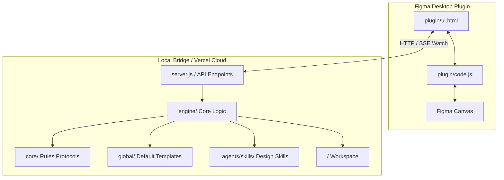

# Morph — AI-Powered Figma Screen Generator

> Turn natural language prompts into production-quality, Auto Layout Figma screens in seconds. Morph is a self-contained AI system that transforms text prompts into editable UI layouts, master component sets, and native Figma variables with minimal token consumption.

  
  
  
  

---

## Quick Start & User Guide

  
  

Morph supports two distinct workflows tailored for designers and developers.

---

### Designer Workflow (Plugin-Only)

Designers can create full UI screens and design systems directly inside Figma without touching code or running local servers.

  

| Step | Action Tag | Instruction |
|---|---|---|
| **Step 1** |  | Import `FigmaPlugin/plugin/manifest.json` into Figma Desktop (`Plugins → Development → Import plugin from manifest`). |
| **Step 2** |  | Click `New Project` and define the project name, domain brief, color palette, typography, and visual taste. |
| **Step 3** |  | Describe desired UI screens using natural language prompts. |
| **Step 4** |  | Click `Build Design System` after generating screens. Morph automatically extracts colors, typography, and component patterns into master variants. |
| **Step 5** |  | Export native Figma Variables and Text Styles directly to your Figma file. |

---

### Developer Workflow (IDE & Agent-Driven)

Developers can run Morph locally using their preferred AI coding assistant (Claude, Cursor, Copilot) with existing subscriptions, avoiding third-party API costs.

  
  

| Step | Action Tag | Instruction |
|---|---|---|
| **Step 1** |  | Clone repository and install dependencies: `git clone https://github.com/Anshul2021/Figma-Mcp.git` `cd Figma-Mcp/FigmaPlugin && npm install` |
| **Step 2** |  | Launch local Node bridge server: `node server.js` |
| **Step 3** |  | Use any coding assistant to execute commands against project directories without third-party API fees. |
| **Step 4** |  | Generated scripts automatically sync to the Figma canvas in real-time via the local SSE bridge. |

---

## Supported Commands

Commands can be passed directly inside prompts or executed via AI coding agents.

| Command | Category Tag | Purpose |
|---|---|---|
| `@newproject <Name>` |  | Initializes project directory structure (`screens/`, `components/`, `tokens/`, `local/`). |
| `@brief <Description>` |  | Defines product domain, target audience, and core features in `local/brief.md`. |
| `@gen-variables` |  | Publishes native Figma color variables and text styles to the Figma file. |
| `@gen-components` |  | Generates master reusable components inside `components/`. |
| `@use-components` |  | Forces screen scripts to instantiate master components (`createInstance()`). |
| `@designsystem` |  | Runs full pipeline: token extraction, component set generation, and screen updates. |
| `@font <FontName>` |  | Overrides font family for the generation session. |
| `@color <Hex1>, <Hex2>` |  | Overrides brand primary and secondary color tokens. |
| `@taste <Description>` |  | Overrides visual styling attributes (radii, borders, shadows). |
| `@skip-autolayout` |  | Disables Auto Layout and uses absolute X/Y positioning. |
| `@skip-design-taste` |  | Bypasses extended design guidelines for minimal token generation. |

---

## MVP Notice & Troubleshooting

Morph is currently an **MVP**. Auto Layout generation is heavily optimized, but occasional layout edge cases may occur depending on prompt complexity.

  

| Issue | Quick Fix Tag | Action |
|---|---|---|
| **Auto Layout Collapse** |  | Use `@skip-autolayout` to generate static absolute positioning, or manually adjust **Hug Contents** / **Fill Container** in Figma's right-hand Auto Layout panel. |
| **Cropped Canvas** |  | If a generated frame is named **"Generated UI Screen"** and appears cropped, select the frame and **ungroup it once** (`Cmd + Shift + G` / `Ctrl + Shift + G`) to reveal the complete screen structure. |

---

## Technical Details & Architecture

### The Problem: Screenshot-Based AI Generation

Most Figma MCP tools rely on image analysis loops (*prompt → screenshot → analyze image → code → repeat*). Vision models consume thousands of tokens per iteration, add 30-60 seconds of latency per loop, and struggle to infer exact padding and alignment constraints from pixels.

  
  
  

---

### The Solution: Code-Driven Direct Execution

Morph eliminates image analysis by generating structured Figma API scripts directly. LLMs understand code far better than raw pixels. Colors, font sizes, paddings, and layout relationships are explicit in code, allowing the model to produce exact, Auto Layout-correct screens in 3-5 seconds with minimal token consumption.

  
  
  

---

### Technical Comparison

| Metric | Screenshot-Based Tools | Morph (Code-Driven) | Advantage Tag |
|---|---|---|---|
| **Input Format** | Heavy Pixel Images | Structured Code Scripts |  |
| **Fidelity** | Estimated Pixel Bounds | Exact Auto Layout Constraints |  |
| **Cost Efficiency** | High Cost Per Iteration | Minimal Token Usage |  |
| **Speed** | 30-60 Seconds Per Loop | 3-5 Seconds Direct Script Execution |  |

---

### Model Optimization Notice

Morph is currently optimized for **Google Gemini Flash** models due to their high speed, large context windows, and strong compliance with structured script synthesis. Support for custom API keys (OpenAI, Anthropic, and local LLMs) will be introduced in future releases.

  
  

---

### System Architecture

---

### Core Execution Protocols (`core/`)

When a generation request is initialized, the system prompt builder reads the core protocol directives:

| File | Protocol Tag | Purpose |
|---|---|---|
| [`core/command.md`](file:///Users/fwcuser/Desktop/Figma-Mcp/FigmaPlugin/core/command.md) |  | Command syntax resolution and priority execution logic. |
| [`core/instruction.md`](file:///Users/fwcuser/Desktop/Figma-Mcp/FigmaPlugin/core/instruction.md) |  | Core screen generation rules, vector icon loading protocols, and typography scaling constraints. |
| [`core/autolayout.md`](file:///Users/fwcuser/Desktop/Figma-Mcp/FigmaPlugin/core/autolayout.md) |  | Mandatory Auto Layout construction order and anti-pattern prevention. |
| [`core/component.md`](file:///Users/fwcuser/Desktop/Figma-Mcp/FigmaPlugin/core/component.md) |  | Master component set creation and instance reuse guidelines. |
| [`core/variables.md`](file:///Users/fwcuser/Desktop/Figma-Mcp/FigmaPlugin/core/variables.md) |  | Native Figma Variables and Local Text Styles publishing protocol. |

---

### Supporting Directories

- **Default Context Templates (`global/`):** Contains baseline reference files (`brief.md`, `colors.md`, `fonts.md`, `taste.md`) copied into each project's `local/` directory upon initialization.
- **AI Skill Registry (`.agents/skills/`):** Domain design skills (`frontend-design`, `design-taste-frontend`, `ui-design-system`, `figma-screen-generator`) automatically injected into prompt context during screen and component generation.
- **Backend Implementation (`engine/`):** Underlying Node.js execution logic for API requests, Gemini model integration, storage management, and rate limiting.

---

### Cloud Deployment (Supabase Storage)

Morph's serverless backend persists projects, screens, and users in **Supabase Storage**.

1. **Create Supabase Project & Bucket:** Create a project at [supabase.com](https://supabase.com) and create a private bucket named `morph`.
2. **Configure Keys:** Set `SUPABASE_URL` and `SUPABASE_SERVICE_ROLE_KEY` in Vercel project environment variables.
3. **Database Schema:** Execute `FigmaPlugin/supabase/schema.sql` in Supabase SQL editor to enable the `users` table and rate-limiting function.

---

### Summary

Morph is a lightweight, high-speed UI generation architecture that bridges natural language prompts directly to native Figma Auto Layout canvas elements. By shifting from image-based vision analysis to direct script synthesis, Morph delivers faster generation times, lower token costs, and extensible workflows for both designers and developers.